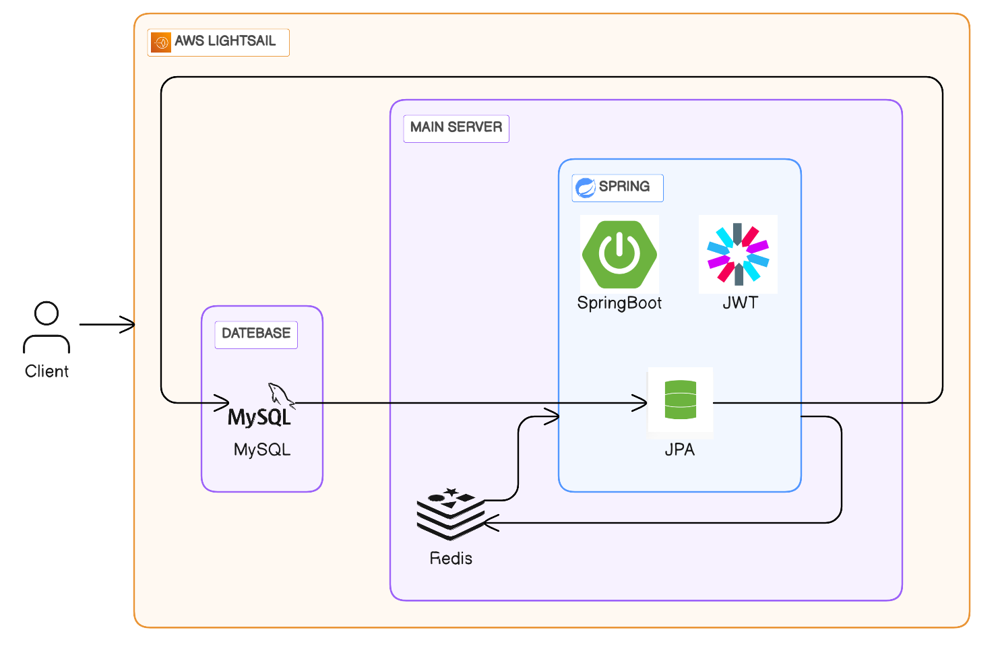

# 광운대학교 와이파이 속도 제공 웹 서비스

## KwFastWifi Back-end

   

## 👥맴버 소개

<table>
    <thead>
        <tr>
            <th style="text-align:center;"><a href="https://github.com/ckdals4600">손창민</a></th>
        </tr>
    </thead>
    <tbody>
        <tr>
            <td></td>
        </tr>
        <tr>
            <td style="text-align:center;">Back-End Developer</td>
        </tr>
    </tbody>
</table>

## 🔗관련 링크

> Back-end: [KwFastWifiBack](https://github.com/OssTeam14/FastWifi_Backend)   
Front-end: [KwFastWifiBack](https://github.com/OssTeam14/FastWifi_Front)   
Web site : <https://github.com/OssTeam14/FastWifi>


## 🔎기능 소개

### ✨건물별에 따른 학교 와이파이 리스트 제공
  * 새빛관
  * 참빛관
  * 비마관
  * 비마관
  * **그외 건물 정보 추후 업데이트 예정**

### ✨학교 와이파이 세부 정보 제공
  * 다운로드 속도
  * 업로드 속도
  * 비밀번호 (권한 필요)
  * 마지막 업데이트 날짜 

### ✨이메일 인증에 따른 로그인
  * 학교 이메일 인증 시 자동으로 비밀번호 확인 권한 제공


## 📃 기술 스택

### 요구사항
> 

   


   


   


>
### Environment


### DateBase


### FrameWork


### Infrastructure


## ⭐ 시작 가이드

### 설치 방법

---

#### 프로젝트 파일 설치

```shell
$ git clone https://github.com/OssTeam14/FastWifi_Backend.git
$ cd FastWifi_Backend
```

#### Redis 설치
1. apt 최신화
```shell
$ sudo apt-get update
$ sudo apt-get upgrade
```

2. redis-server 설치
```shell
# 설치
$ sudo apt-get install redis-server

# 설치(버전) 확인
$ redis-server --version
```

3. redis 기초 설정
```shell
# vi 편집기로 설정 파일 조회(redis.conf)
sudo vi /etc/redis/redis.conf
```
* 아래 내용 추가
```shell
# 최대 메모리 사양
# ->    최대 사용 메모리 사양을 256mb로 설정한다. 단위는 mb나 g 등 필요에 맞춰 적어주면된다.
maxmemory 256mb            

# 메모리 초과 사용 시 후처리 방식 설정
# ->    지금 설정한 allkeys-lru 옵션은 가장 오래된 데이터를 삭제하고, 새로운 데이터를 저장하는 옵션이다.
maxmemory-policy allkeys-lru

# 프로세스 포트
# ->    port 부분은 초기에 주석처리가 되어 있는데, 디폴트 값으로 6379 포트에서 동작한다. 
# ->    만약, 6379가 아닌 다른 포트를 설정하고 싶다면 주석을 해제하고 포트번호를 입력하면된다.
port 1234

# 외부접속 허용
# ->    기본 실행 환경은 localhost(127.0.0.1)로 되어있다.
# ->    만약, 모든 외부접속에 대한 허용을 하고 싶다면, 0.0.0.0 으로 변경하면 된다.
bind 0.0.0.0

# 비밀번호 설정
# ->    서버 접속에 비밀번호를 적용시키고 싶다면 아래와 같이 수정하자.
requirepass [접속 패스워드 입력]

# 암호화된 비밀번호가 필요하다면, 터미널에 다음 명령어로 생성 가능하다.
echo "MyPassword" | sha256sum
```

4. redis 재실행 및 실행 확인
```shell
# 레디스 프로세스 재시작
sudo systemctl restart redis-server.service

# 실행확인
netstat -tnlp | grep [레디스 실행포트]
```

### 프로젝트 셋팅

---

#### application.yml
```yaml
spring:
  datasource:
    driver-class-name: com.mysql.cj.jdbc.Driver
    url: jdbc:mysql://DB주소/사용할 DB 이름?useSSL=false&useUnicode=true&serverTimezone=Asia/Seoul
    username: 아이디
    password: 비번

  jpa:
    show-sql: true
    database: mysql
    hibernate:
      ddl-auto: update
    properties:
      hibernate:
        format_sql: true

  jwt:
    secret: c3ByaW5nLWJvb3Qtc2VjdXJpdHktand0LXR1dG9yaWFsLWppd29vbi1zcHJpbmctYm9vdC1zZWN1cml0eS1qd3QtdHV0b3JpYWwK
    access-token-valid-minute: token 유효 시간

  redis:
    host: 서버 주소
    port: 6379
    password : redis 비밀 번호

  mail:
    host: smtp.gmail.com
    port: 587
    username: gmail 아이디
    password: 앱 비밀번호
    properties:
      mail:
        smtp:
          auth: true
          starttls:
            enable: true
            required: true
          connectiontimeout: 5000
          timeout: 5000
          writetimeout: 5000
    auth-code-expiration-millis: 1000*60*10
```

#### 구글 SMTP 설정   
참고 자료 : [즐코딩 - KINcoding의 Google - Gmail SMTP 사용을 위한 세팅](https://kincoding.com/entry/Google-Gmail-SMTP-%EC%82%AC%EC%9A%A9%EC%9D%84-%EC%9C%84%ED%95%9C-%EC%84%B8%ED%8C%85)   
  
#### 학교 메일 인증 설정
```java
public final class Constants {
    ~~~
    
    public static final String KW_MAIL_REGEXP = "^[A-Za-z0-9._%+-]+@학교 메일 주소$";
    
    ~~~
}

```

### 실행 방법 - 리눅스 환경

---

#### 1. 프로젝트 빌드 수행 파일 생성

* 파일명.sh 

```shell
#!/bin/bash

#1
REPOSITORY=#FastWifi_Backend 상위 폴더 경로
PROJECT_NAME=FastWifi_Backend

#2
cd $REPOSITORY/$PROJECT_NAME/

#3
echo "> GIT PULL"
git pull origin main

#4
echo "> Project Build Start"

./gradlew build

#5
echo "> Move to app Directory"

cd $REPOSITORY

#6
echo "> Duplicate Build file"

cp $REPOSITORY/$PROJECT_NAME/build/libs/*.jar $REPOSITORY/

#7
echo "> Kill Use :8080 PID"
USE_8080_PID=$(lsof -i :8080 | grep LISTEN | awk '{print $2}')
kill -9 $USE_8080_PID

#8
echo "> Check The Currently Running Application PID"

CURRENT_PID=$(pgrep -f ${PROJECT_NAME}.*.jar)

echo "Currently Running Application PID: $CURRENT_PID"

#7
if [ $CURRENT_PID -z ]
then
	echo "> Since there are no applications currently running, it will not terminate."
else
	echo "kill -15 $CURRENT_PID"
	kill -15 $CURRENT_PID
	sleep 5
fi

echo "> New Application Deploy"

#8
JAR_NAME=$(ls -tr $REPOSITORY/ | grep jar | tail -n 1)

echo "> JAR Name: $JAR_NAME"
```

2. 빌드 수행 파일 실행

```shell
$ ./파일명.sh
```


## ⚙ 시스템 아키텍쳐




## 📂 폴더 구조

```
📂 src
┣ 📂 main
┃  ┣ 📂 java.com.dnd.exercise
┃  ┣ 📂 auth
┃  ┃  ┣ 📂 controller
┃  ┃  ┣ 📂 dto
┃  ┃  ┃  ┣ 📂 request
┃  ┃  ┃  ┣ 📂 response
┃  ┃  ┣ 📂 repository
┃  ┃  ┣ 📂 service
┃  ┣ 📂 common
┃  ┃ ┣ BaseEntity.enum
┃  ┃ ┣ constant.class
┃  ┃ ┣ ResponseDto.class
┃  ┃ ┣ RedisService.class
┃  ┣ 📂 config
┃  ┃  ┃  ┣ CorsConfig.class
┃  ┃  ┃  ┣ EmailConfig.class
┃  ┃  ┃  ┣ RedisConfig.class
┃  ┃  ┃  ┣ SecurityConfig.class
┃  ┃  ┃  ┣ WebConfig.class
┃  ┣ 📂 error
┃  ┣ 📂 dto
┃  ┃  ┃  ┣ ErrorResponse.class
┃  ┃  ┃  ┣ ErrorCode
┃  ┃  ┣ 📂 exception
┃  ┃  ┃  ┣ BusinessException.class
┃  ┃  ┣ 📂 handler
┃  ┃  ┃  ┣ GlobalExceptionHandler.class
┃  ┣ 📂 jwt
┃  ┣ 📂 member
┃  ┃  ┣ 📂 entity
┃  ┃  ┣ 📂 repository
┃  ┣ 📂 verification
┃  ┃  ┣ 📂 controller
┃  ┃  ┣ 📂 dto
┃  ┃  ┃  ┣ 📂 request
┃  ┃  ┃  ┣ VerifyingType.enum
┃  ┃  ┣ 📂 service
┃  ┣ 📂 wifi
┃  ┃  ┣ 📂 controller
┃  ┃  ┣ 📂 dto
┃  ┃  ┃  ┣ 📂 enum
┃  ┃  ┃  ┣ 📂 request
┃  ┃  ┃  ┣ 📂 response
┃  ┃  ┃  ┣ WifiMapper.class
┃  ┃  ┣ 📂 entity
┃  ┃  ┣ 📂 repository
┃  ┃  ┣ 📂 service
┣ 📂 resources
┃  ┣ 📂 static
┃  ┣ 📂 templates
┃  ┣ application.properties
┣ FastWifiApplication.class
```

## 📚 라이센스
```
MIT License

Copyright (c) 2023 OssTeam14

Permission is hereby granted, free of charge, to any person obtaining a copy
of this software and associated documentation files (the "Software"), to deal
in the Software without restriction, including without limitation the rights
to use, copy, modify, merge, publish, distribute, sublicense, and/or sell
copies of the Software, and to permit persons to whom the Software is
furnished to do so, subject to the following conditions:

The above copyright notice and this permission notice shall be included in all
copies or substantial portions of the Software.

THE SOFTWARE IS PROVIDED "AS IS", WITHOUT WARRANTY OF ANY KIND, EXPRESS OR
IMPLIED, INCLUDING BUT NOT LIMITED TO THE WARRANTIES OF MERCHANTABILITY,
FITNESS FOR A PARTICULAR PURPOSE AND NONINFRINGEMENT. IN NO EVENT SHALL THE
AUTHORS OR COPYRIGHT HOLDERS BE LIABLE FOR ANY CLAIM, DAMAGES OR OTHER
LIABILITY, WHETHER IN AN ACTION OF CONTRACT, TORT OR OTHERWISE, ARISING FROM,
OUT OF OR IN CONNECTION WITH THE SOFTWARE OR THE USE OR OTHER DEALINGS IN THE
SOFTWARE.
```
 


